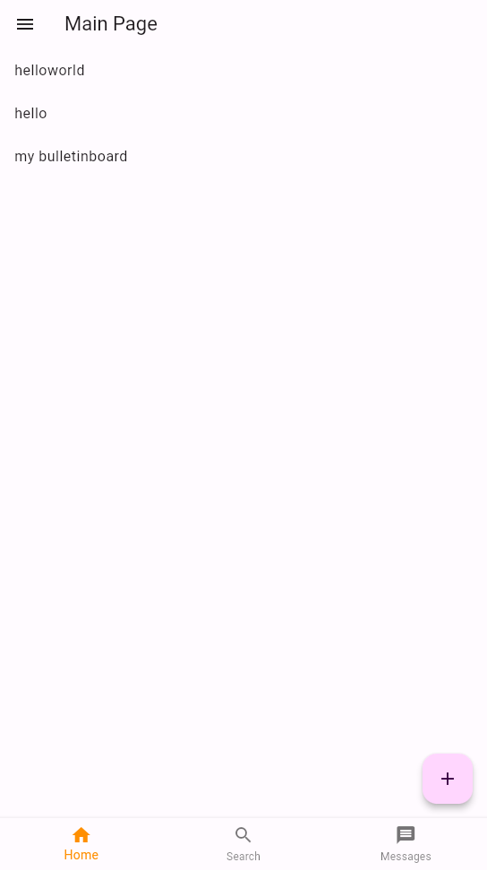
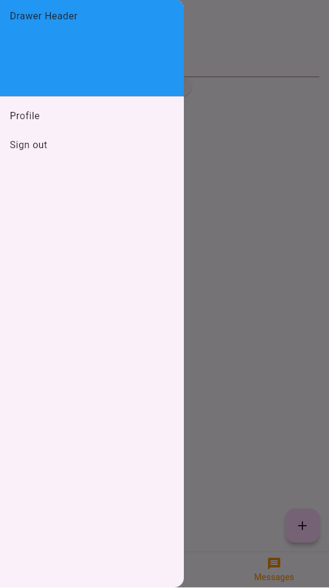

# bulletinboard

A new Flutter project using firebase.

Twitter-like bulletinboard app for internship and individual concern.

ユーザーにはfirebase_authによりuidが自動的に割り当てられる。
firestoreのデータはuidによって管理される部分があり、例えばusernameなど。
uidからfirestoreのusernameに毎回アクセスすると待ち時間が発生し、ユーザー体験を損なう。
そこでusernameも常に所持する。（uidはもちろん所持している）
それぞれの関数に毎回uidとusernameを渡しているがわかりにくい。
providerを導入するとproviderからデータを取ってくるのに待ち時間が発生する？

